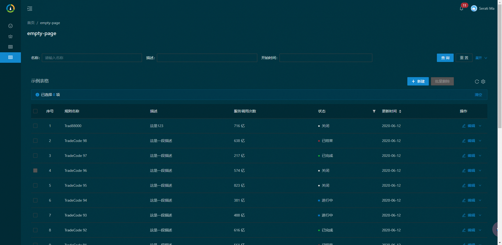
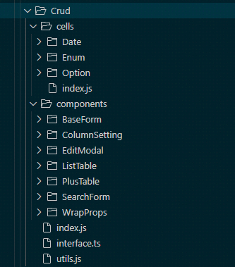

# Ant Design pro Admin Skeleton 

基于Antd Pro 后台管理脚手架

## 初始化

在根目录 创建.env.json 配置文件
```json
{
    "ENV": "dev",
    "API_HOST": ""
}
```

## 增加CRUD 组件.
常用的增,删,改,查功能,基于React Hook 重写了crud 所有组件.


主要功能:
* 搜索表单,支持'or','and'
* 工具条
* 通用的表格
* 根据返回数据生成筛选,排序,分页
* 生成对后端友好的 search+search_fields+filter+sorter+page+fields
* 编辑表单
* 编辑弹框

功能接口定义详见,`src/crud/interface.ts`文件

目录结构说明: 



目录 | 描述
--- | ---
cells | 表格单元格渲染组件目录
- Date | 日期格式化组件
- Enum | 状态枚举组件
- Option | 操作菜单组件
components | 可以单独引用的组件
- BaseFrom | 可配置的基础表单组件
- ColumnSetting | 表头列选择组件
- EditModal | 弹框编辑组件
- ListTable | 基础的表格组件
- PlusTable | 整合了所有功能的表格组件
- SearchForm | 搜索表单组件
- WrapProps | 通用的扩展组件属性函数,如给所有组件加cleanabled={true}
index.jsx | 引用入口
utils | 帮助类
interface.ts | 接口定义TS

### PlusTable 使用例子
参考EmptyPage
目录组织
```
EmptyPage
    - components // 子组件目录
        - CreateForm.jsx // 新增表单
        - UpdateForm.jsx // 修改表单
    - index.jsx // 主入口
    - index.less // 主样式
    - service.js // 网络请求类
```

示例 index.jsx 如下:

```jsx
import { PlusOutlined, EditOutlined, DeleteOutlined, MoreOutlined, } from '@ant-design/icons';
import { Button,  message } from 'antd';
import React, { useRef } from 'react';
import { PageHeaderWrapper } from '@ant-design/pro-layout';
import { PlusTable } from '@/components/Crud';
import { DateCell, EnumCell } from '@/components/Crud/cells'
import CreateForm from './components/CreateForm'
import UpdateForm from './components/UpdateForm'
import { query, remove } from './service';

const TablePage = () => {

  const createRef = useRef();
  const updateRef = useRef();

  // 这个搜索的字段
  const SearchFields = [
    {
      name: 'name',
      label: '名称',
      placeholder: '请填写名称',
      condition: '=',
      render() {
          return <Input 
            placeholder="请输入名称" 
            autoComplete="off" 
            allowClear={true}
           /> 
      }
    },
    {
        name: 'desc', 
        label: '描述', 
        placeholder: '', 
        condition: 'like' 
    },
    { name: 'create', label: '开始时间', }
  ];

  // 这是表格的字段列表
  const columns = [
    {
      title: '规则名称',
      dataIndex: 'name',
    },
    {
      title: '描述',
      dataIndex: 'desc',
      hide: true,
    },
    {
      title: '服务调用次数',
      dataIndex: 'callNo',
      render: val => `${val} 亿`,
    },
    {
      title: '状态',
      dataIndex: 'status',
      filters: [
        {
          text: '激活',
          value: '1',
        },
        {
          text: '禁用',
          value: '0',
        },
      ],
      // 只支持 dom 和 函数组件
      valueType: <EnumCell />,
    },
    {
      title: '更新时间',
      dataIndex: 'updatedAt',
      sorter: 'ascend',
      valueType: <DateCell format="yyyy-MM-dd" />
    },
  ];


  // 删除
  const removeHandle = async (ids) => {
    const res = await remove({ ids: ids });
    if (res.status == 'ok') {
      message.success(res.msg || '操作完成')
    } else {
      return false;
    }
    return true;
  }

  // 渲染工具栏
  const toolBarRender = (action, { selectedRowKeys, selectedRows }) => {
    return [
      <Button
        type="primary"
        onClick={() => {
          createRef.current.show()
        }}
      >
        <PlusOutlined /> 新建
        </Button>
      ,
      <Button
        danger
        disabled={(!selectedRowKeys || selectedRowKeys.length < 1)}
        onClick={async e => {
          await removeHandle(selectedRowKeys)
          action.cleanSelect();
          action.reload();
        }}
      >
        批量删除
        </Button>
      ,
    ];
  }


  // 操作区
  const options = [
    { key: 'edit', title: '编辑', icon: <EditOutlined /> },
    { key: 'delete', title: '删除', icon: <DeleteOutlined />, confirm: '确认删除该记录么?' },
    { key: 'detail', title: '详情', icon: <MoreOutlined /> },
  ]


  // 操作区点击事件
  const onOptionChange = async (key, record, action) => {
    switch (key) {
      case 'edit':
        console.log('修改')
        updateRef.current.show(record)
        break;
      case 'delete':
        await removeHandle([record.id])
        action.cleanSelect();
        action.reload();
        break;
      case 'detail':
        console.log('详情');
        break;
    }
  }


  // 渲染其他的,如弹框
  const otherRender = (action) => {
    return <>
      <CreateForm
        debug={true} // 开启调试
        actionRef={createRef}
        onSuccess={(ref, response) => {
          action.reload();
        }}
      />
      <UpdateForm
        debug={true} // 开启调试
        actionRef={updateRef}
        onSuccess={(ref, response) => {
          action.reload();
        }}
      />
    </>
  }

  return (
    <PageHeaderWrapper>
      <PlusTable
        rowKey='id'
        columns={columns}
        request={query}
        searchFields={SearchFields}
        // relation='and' // 组合关系
        // bordered={true}
        // pageSize={10}
        title="示例表格"
        debug={true} // 开启调试
        // ellipsis={true} 所有自动提示
        //showHeader={false}
        //showAlert={false}
        //showToolbar={false}
        //showAutoIndex={false} // 序号
        //selectionType='radio'// default 'checkbox | radio'
        // tableAlertRender={(selectKeys, selectedRows) => {
        //   return `已选择 ${selectKeys.length} 项,共计`
        // }}
        toolBarRender={toolBarRender}
        otherRender={otherRender}
        options={options}
        onOptionChange={onOptionChange}
      />

    </PageHeaderWrapper>
  );
};

export default TablePage;
```

### PlusTable 接口

参数 | 说明 | 类型 | 默认值
---|---|---|---
rowKey| 记录唯一值字段,常用id,key | `string` | id
columns | 表头定义,默认'text' | `Column({title,dataIndex,render})[]` | []`
request | 网络请求类,参考`service.js` | `Request` | -
searchFields | 搜索表单字段定义 | `Field[]` | []
relation | 搜索字段SQL,and 或 or连接 | `and | or` | and
pageSize | 默认分页数 | `number` | 20
title | 表格标题 | `string` | -
debug | 开启调试,会在控制台打印出关键内容 | `boolean` | false
ellipsis | 表格过长文本,自动省略 | `boolean` | true
showHeader | 显示头部 | `boolean` | true
showAlert | 显示提示 | `boolean` | true
showToolbar | 显示工具条 | `boolean` | true
showAutoIndex | 自增序号 | `boolean` | true
selectionType | 选择类型 | `checkbox | radio` | checkbox
tableAlertRender | 自定义渲染提示内容 | `(selectKeys: [],selectedRows: [],action: PlusTableAction): Component` | -    
toolBarRender| 自定义渲染工具条|`(action: PlusTableAction,{ selectedKeys: [], selectedRows: [] }): Component`|-
otherRender | 其它内容渲染区| `(action: PlusTableAction): Component` | -
options | 行操作菜单 | `{key: string,title: string,icon?:IconFontProps}`
onOptionChange | 操作按扭点击事件 | `(key: string,record: object,action: PlusTableAction): void`
...props | 其它参考antd 的表格接口 | any | -


### EditModal 接口
```ts
interface EditModalProps {
    /** 表格的ref */
    actionRef?: object,
    /** 表单字段属性 */
    fields: [FormField],
    /** 标题 */
    title: string,
    /** 提交按扭 */
    submitText?: string,
    /** 正在提交的按扭 */
    loadingText?: string,
    /** 重置的文案 */
    resetText?: string,
    /** 网络请求 */
    request: Request,
    /** 成功回调 */
    onSuccess: PostSuccessCallback,
    /** 表单提交事件 */
    onSubmit: SubmitEvent,
    /** 表单变更事件,可用于联动 */
    onChange: FormChangeEvent,
    /** 开启调试 */
    debug: boolean
}
interface FormField {
    /** 表单名称,唯一值 */
    name: string,
    /** 标签,在提示,rule会复用 */
    label: string,
    /** 控制提示 */
    placeholder?: string,
    /** 输入规则 */
    rules?: [Rule],
    /** 扩展提示 */
    extra?: string,
    /** 是否显示 标签后的':' */
    colon?: boolean,
    /** 自定义渲染组件,默认是Input控件 */
    render?: FormRender,
}
```
参数 | 说明 | 类型 | 默认值
---|---|---|---
actionRef | 组件ref | `{show: (DefaultValues: {}) => void,hide: Function,}` | -
fields | 表单项定义,render默认使用Input 组件 | `({ name: string,label: string, placeholder?: string,rules?: [Rule],extra?: string,colon?: boolean,render?: FormRender})`
title | 标题 | `string` | ''
submitText | 提交按扭文案 | `string` | 提交
loadingText | 正在提交文案 | `string` | 正在提交
resetText | 重置文案 | `string` | 重置
request | 网络请求类 | `Request` | -
onSuccess | 网络请求成功 | `(action: EditFormAction, response: Response): void` | -
onSubmit | 表单验证成功 | `(values: object, action: EditFormAction): void` |
onChange | 表单变动 | `(value: object, action: EditFormAction): void` | -
debug  | 调试 | `boolean` | false


 其它类参考源代码.
## 封装请求类

## 封装了缓存类

## 封装了动态菜单
